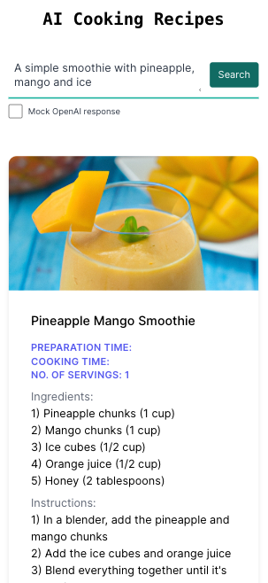

# cooking-recipes-ai

A sample application that employs OpenAI API's for producing randomized cooking recipes, accompanied by the recipe image generated by DALL-E




## Prerequisite

- You need to signup for an OpenAI account before you can run this application.
- Once you have the account setup, create a `.env.local` file and add the following keys from your OpenAI account

```
OPENAI_API_KEY="<YOUR_API_KEY>"
OPENAI_ORGANIZATION="<YOUR_ORG_ID>"
```

> 🚨🚨🚨 PLEASE NOTE: Since we generate random recipe and an associated recipe image using OpenAI API's, you will be billed according the OpenAI pricing rules. Please refer to OpenAI pricing rules and be mindful about this as running this application using your own API key would incur costs to your account. Also DO NOT SHARE your OPENAI_API_KEY & OPENAI_ORGANIZATION with others as that could be misused.🚨🚨🚨

## Getting Started

Once you have the prerequisites setup:

- Start the app using:

```bash
npm run dev
# or
yarn dev
# or
pnpm dev
```

Open [http://localhost:3000](http://localhost:3000) with your browser to see the result.


## Credits 

- This code is based on my learning's from Colby Fayock [egghead course](https://egghead.io/courses/get-started-with-ai-driven-app-development-using-the-openai-node-js-sdk-b8d4b04e). This sample application is just putting my learings from the course to practice.
- The sample image used in mock response was generated by Dall-E. 
- This is a [Next.js](https://nextjs.org/) project bootstrapped with [`create-next-app`](https://github.com/vercel/next.js/tree/canary/packages/create-next-app).